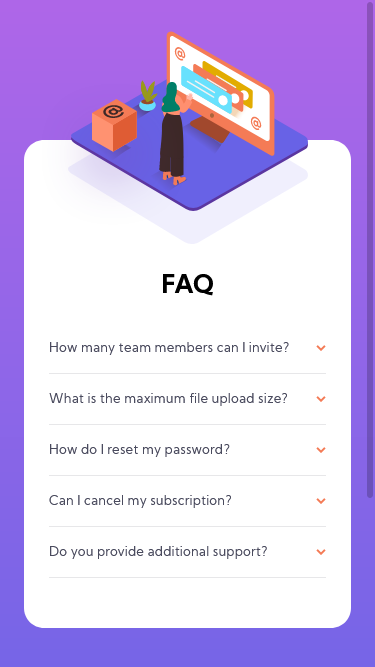
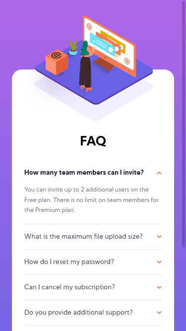
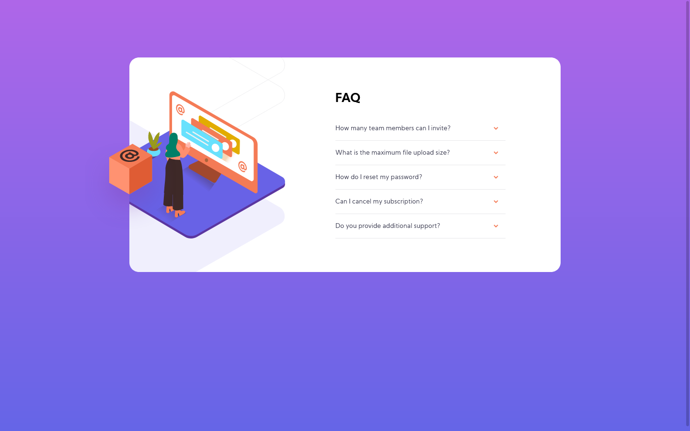
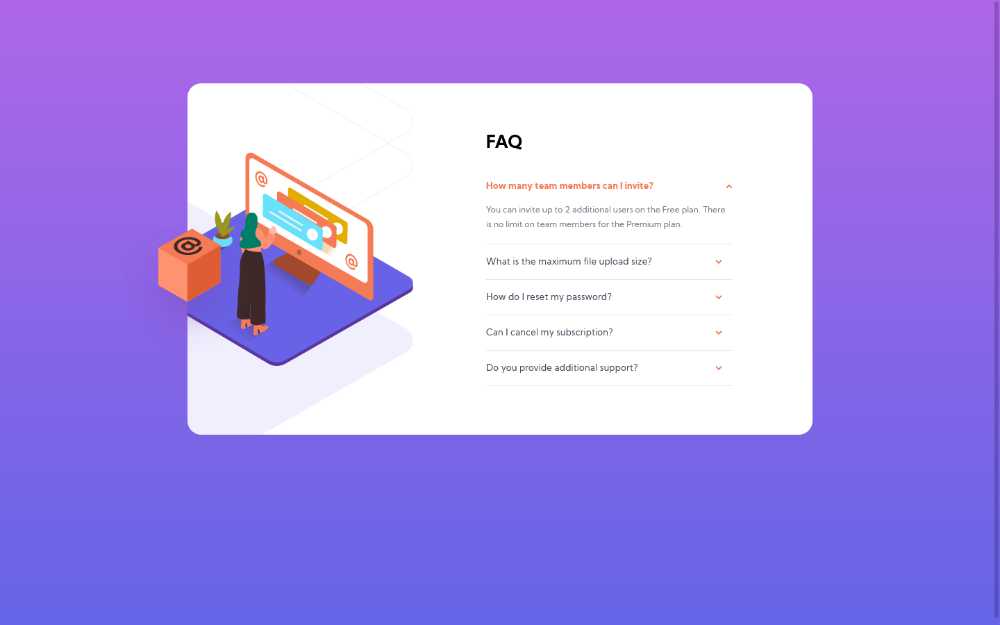
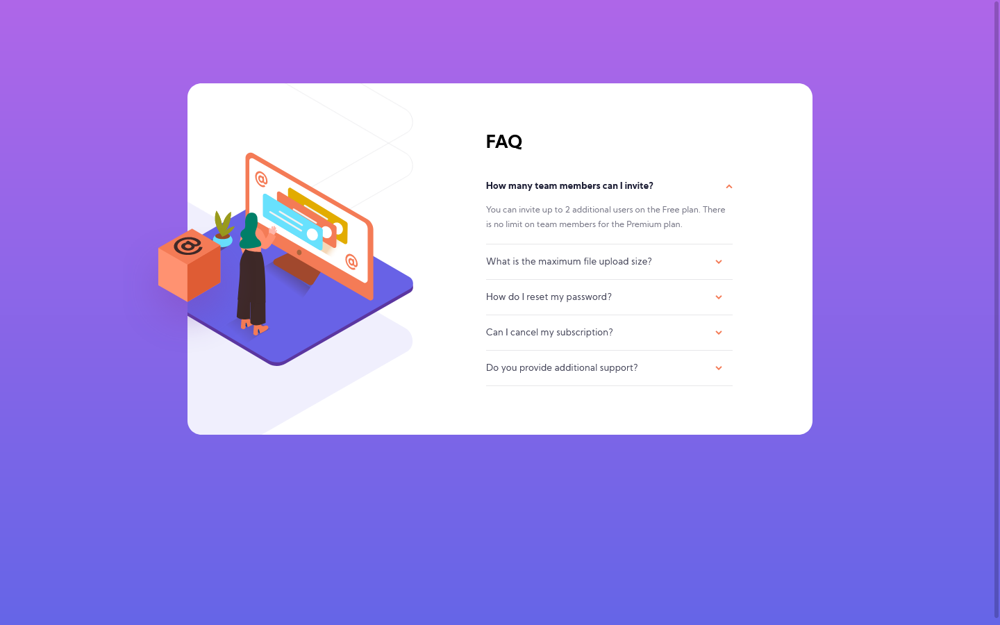

# Frontend Mentor - FAQ accordion card solution

This is a solution to the [FAQ accordion card challenge on Frontend Mentor](https://www.frontendmentor.io/challenges/faq-accordion-card-XlyjD0Oam). Frontend Mentor challenges help you improve your coding skills by building realistic projects.

## Table of contents

- [Overview](#overview)
  - [The challenge](#the-challenge)
  - [Screenshot](#screenshot)
  - [Links](#links)
- [My process](#my-process)
  - [Built with](#built-with)
  - [What I learned](#what-i-learned)
  - [Continued development](#continued-development)
  - [Useful resources](#useful-resources)
- [Author](#author)

## Overview

### The challenge

Users should be able to:

- View the optimal layout for the component depending on their device's screen size
- See hover states for all interactive elements on the page
- Hide/Show the answer to a question when the question is clicked

### Screenshot

Mobile




Desktop






### Links

- [Solution URL](https://github.com/LuisStiveSilva/frontendmentor-challenge-3)
- [Live Site URL](https://luisstivesilva.github.io/frontendmentor-challenge-3/)

## My process

### Built with

- Semantic HTML5 markup
- Sass
- Flexbox
- Mobile-first workflow
- JavaScript

### What I learned

First, i learned how to position the images and the background image. Then i learned how to work with JS. This was my first time with it.

```scss
.box {
  display: block;
  position: absolute;
  z-index: 1;
  left: 0;
  top: 50%;
  transform: translateX(-48.5%) translateY(-25%);
}
```

```scss
background-image: url(/images/bg-pattern-mobile.svg);
background-repeat: no-repeat;
background-position: top center;
```

### Continued development

I must to practice more of my js.

### Useful resources

- [Accordion](https://getbootstrap.com/docs/5.0/components/accordion/) - This was my reference.

## Author

- Website - [Luis Silva](https://github.com/LuisStiveSilva)
- Frontend Mentor - [@luis-silva-hub](https://www.frontendmentor.io/profile/luis-silva-hub)
